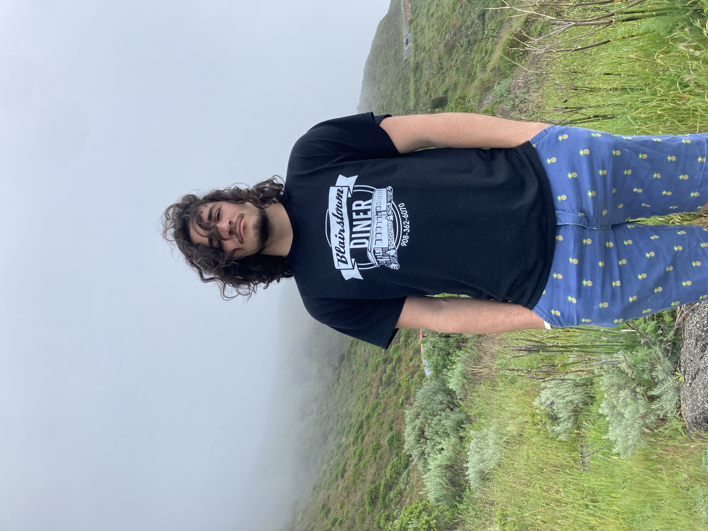

# Nathan Dowd


## A Brief Synopsis
____

### Early Life

Prior to 2004, I did not exist. After a relatively uneventful birth, I came into being. I have mixed feelings about this. Following this inherently traumatizing experience, my life began in Virginia, where I lived in [Suffolk](https://www.suffolkva.us/) from the age of 4 to 18. I had 3 older brothers and a younger sister, and attended a small private school, where I played football, basketball, and lacrosse throughout all of school.

### Computer Science Origins

In my junior year of high school, I took my first computer science course, and promptly became engrossed with the possibilities and decided this was what I wanted to spend my entire life doing. The moment I learned about scanners, I wrote an entirely too long text based game using that one functionality. The intro is shown below, and as you can imagine, it was an absolute banger of a game.

```
    Scanner a = new Scanner(System.in);
    System.out.println("You wake up in a strange, small room. You hear the light humming of a distant engine and you feel the whole place start moving upward.
    \nIt would appear you are on some sort of aircraft.\nThe room is made out a strange metallic material you don't recognize, and the only noticeable feature
    is a large air vent in the wall.\nIt appears to be missing 3 of its screws already. You hear someone or something approaching from the far side of the room.
    \nWould you like to go inspect the other side of the room (type I), or try to take the vent cover off and escape (type V)?");
    String b = a.nextLine();
```

### College

Following my revelation, I applied to universities all across the country (pretty much just California), and accidentally ended up here in Warren college, living a _life in balance_. Apparently this implies a lot more computer science than anything else, but I am also involved in volunteering, a minor in philosophy, a leadership position in Warren Honors Council, and quite a bit of pickleball and volleyball. Personally, I think Warren should consider a rebrand, and make this their new motto:

> A life in balance... unless you're a CSE major, then just focus on taking as many STEM classes as humanly possible.

### Classes

Onto those classes I've been complaining about. Realistically, their not that bad, I have enjoyed most of them, and managed to keep a 3.98 GPA, so really I shouldn't be complaining. In no particular order, here are the important classes I've taken at UCSD.

+ 12, Basic Data Structures and Object-Oriented Design
+ 15L, Software Tools and Techniques Laboratory
+ 30, Computer Organization and Systems Programming
+ 100, Advanced Data Structures 
+ 101, Design and Analysis of Algorithms

Followed by a list of the programming languages I've learned, ordered by preference

1. C
2. Java
3. Python
4. Markdown
5. ARM
6. C++
7. Bash

Looking to expand on that list though

### Future Goals

It's always good to set goals, and note down your acheived goals, so let's make a list of what I want to do with my life.

- [x] Birth
- [x] Learn to read
- [x] Presidential Fitness in 3rd Grade
- [x] Graduate High School
- [x] Go To College
- [ ] Dunk
- [ ] Graduate College
- [ ] Figure Out What I'm Gonna Do With My Life (maybe that should be before graduation)
- [ ] Do Whatever That May Be

Alright, well that's all I've figured out so far in regards to me, so hope you enjoyed. Also, whoever ends up reading this, you should check out this previous markdown website I made

> [__Bird__](https://nathand0wd.github.io/BIRD/bird)
